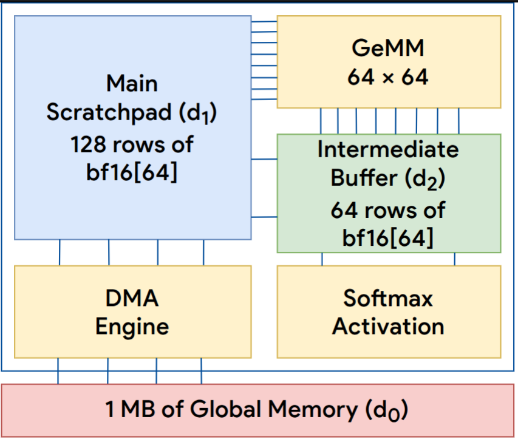

# Hands-on Exercise 1: Specifying a New Accelerator ISA



In this hands-on exercise, we will guide you through the process of specifying a new accelerator ISA using TAIDL (Tensor Accelerator ISA Definition Language)'s Python-based API. The API directly mirrors the formal ISA constructs introduced in the ACT paper: memory hierarchy (data models), instruction sets with operational semantics, and other essential components of the ISA. You will learn how to describe a domain-specific tensor accelerator from scratch, using the **QKV accelerator** as our running example.

## Overview: The QKV Accelerator

### The QKV Attention Mechanism

The Query-Key-Value (QKV) attention mechanism is the fundamental building block of transformer models, which have revolutionized natural language processing, computer vision, and generative AI. The attention operation can be expressed as:

```
Attention(Q, K, V) = softmax(Q × K^T) × V
```

where Q (query), K (key), and V (value) are typically matrices of shape `[seq_len, hidden_dim]`. This operation is compute-intensive, especially for long sequences, making it a prime target for hardware acceleration.

### QKV Accelerator Architecture

The QKV accelerator is a specialized tensor accelerator designed specifically for efficient attention computation. Its key architectural features include:

- **Dual On-chip Scratchpads**: Two scratchpad memories (`d1` and `d2`) optimized for different access patterns
  - `d1`: Primary buffer for input/output data (128 rows × 64 columns)
  - `d2`: Intermediate computation buffer (64 rows × 64 columns)
- **BF16 Datatype**: Uses Brain Floating Point (BF16) for efficient mixed-precision computation
- **Specialized Instructions**: Hardware support for matrix multiplication, softmax, and efficient data movement
- **Row-major and Column-major Support**: Flexible memory access patterns to minimize data layout transformations

This accelerator exemplifies the coarse-grained, tensor-oriented ISA design philosophy commonly observed in commercial tensor accelerators like Google's TPU and AWS Trainium -- instructions operate on entire tensor blocks rather than individual elements.

---

## Understanding Memory Hierarchies in Tensor Accelerators

Before diving into the QKV accelerator specification, let's understand how memory hierarchies evolve from classical scalar processors to modern tensor accelerators.

### From Scalar to Tensor: Evolution of Register Files

**1. Scalar Register Files (x86-64 GPRs)**

```python
# Classical CPU: 16 general-purpose 64-bit registers
# Each register holds a single scalar value
acc.add_data_model("gpr", [16], [], "i64")
```

- Granularity: Individual 64-bit integers
- Example: `rax`, `rbx`, ..., `r15`

**2. Vector Register Files (AVX-512 ZMM)**

```python
# SIMD extension: 32 vector registers, each 512-bit wide
# Each register holds 16 float32 or 8 float64 values
acc.add_data_model("zmm", [32], [16], "f32")
```

- Granularity: Vectors of 16 elements
- Operations: Element-wise SIMD operations

**3. Tile Register Files (Intel AMX)**

```python
# Matrix extension: 8 tile registers, each 16×64 bytes
# Each tile holds a 2D matrix for tensor operations
acc.add_data_model("tiles", [8], [16, 64], "s8")
```

- Granularity: 2D tiles (16 rows × 64 columns)
- Operations: Matrix multiplication, tile loads/stores

**4. Scratchpad Memories (Gemmini, TPU-style)**

```python
# On-chip SRAM: Large capacity, software-managed
# Organized as a 2D array of elements
acc.add_data_model("spad", [1024 * 16], [16], "s8")  # Main scratchpad
acc.add_data_model("acc", [64 * 16], [16], "s32")    # Accumulator buffer
```

- Granularity: Configurable rows of 16 elements
- Management: Explicit software-controlled data movement

**5. QKV Accelerator Memory Hierarchy**

```python
# Specialized for attention: Two scratchpad levels
# d1: Primary I/O buffer, d2: Computation buffer
qkv.add_data_model("d1", [128], [64], "bf16")
qkv.add_data_model("d2", [64], [64], "bf16")
```

- Granularity: Rows of 64 BF16 elements
- Design: Optimized for matrix tiles and attention patterns

### Key Observation

As we move from scalar to tensor accelerators, the fundamental trend is:

- **Higher dimensionality**: 0D (scalar) → 1D (vector) → 2D+ (tile/scratchpad)
- **Coarser granularity**: Single values → Fixed-width SIMD lanes → Fixed-shape Tiles → Variable-size Tensor blocks

This motivates the **data model abstraction** in TAIDL -- a unified formalism to describe memory hierarchies across different accelerator designs.

---

## Step 1: Setting Up Your Development Environment

Let's begin by preparing the boilerplate ISA specification file.

From your host machine in the `tutorials/micro25/` directory, copy the boilerplate for Exercise 1.

```bash
./copy.sh exercise1
```

The `copy.sh` script will copy the boilerplate `QKV.py` file to the base of the `act/` repository.

### File Structure

Your `QKV.py` file should begin with:

```python
"""QKV Accelerator ISA Definition"""

from taidl import Accelerator

qkv = Accelerator("QKV")
```

This imports the TAIDL framework and creates an accelerator object named "QKV". The `Accelerator` class provides methods to define data models, instructions, and generate programming infrastructure.

You can now edit this file in your preferred editor on your host machine.

---

## Step 2: Defining the Data Model

The **data model** specifies the on-chip memory hierarchy: the number of buffers, their capacity, dimensionality, and element types. This directly corresponds to the formal construct $D^H [d_i]$ in the ACT paper.

### Create the Accelerator Object

```python
# Create an accelerator named "QKV"
qkv = Accelerator("QKV")
```

### Add Data Models

The QKV accelerator has two scratchpad buffers:

```python
# d1: Primary scratchpad for input/output tensors
# - 128 rows (first dimension)
# - 64 columns (second dimension)
# - BF16 element type
qkv.add_data_model("d1", [128], [64], "bf16")

# d2: Secondary scratchpad for intermediate computations
# - 64 rows
# - 64 columns
# - BF16 element type
qkv.add_data_model("d2", [64], [64], "bf16")
```

**Interpretation:**

- `"d1"`: Buffer name (used in instruction operands)
- `[128]`: Capacity in the first dimension (addressable rows)
- `[64]`: Shape of each addressable unit (64 BF16 elements per row)
- `"bf16"`: Element datatype (Brain Floating Point 16-bit)

**Key Design Decisions:**

1. **Why BF16?** Offers a good balance between precision and hardware efficiency for neural network computations
2. **Why 64 columns?** Matches common attention head dimensions and enables efficient matrix tiling
3. **Why two buffers?** `d1` for I/O (larger), `d2` for computation (sized for 64×64 matrix intermediates)

In addition to these on-chip buffers, there's an implicit **off-chip memory** (`d0`) representing HBM/DRAM, which is always available as the source/sink for load/store operations.

---

## Step 3: Defining the Instruction Set

### Understanding Instruction Components

**Attributes (Constraints):**
Unlike classical ISAs where operands are just register numbers, tensor accelerator instructions have both:

- **Addressing attributes**: Buffer addresses (analogous to register indices)
- **Computational attributes**: Configuration parameters (e.g., `n` = number of rows to process)

**Read/Write Locations:**
Specify which data models are accessed, at what addresses, and how many addressable units:

```python
instr.set_inputs([[buffer_name, [address_attr], [size_of_input]]])
instr.set_outputs([[buffer_name, [address_attr], [size_of_output]]])
```

**Operational Semantics:**
A functional description in XLA-HLO syntax, using SSA (Static Single Assignment) form and tensor operations.

### XLA-HLO: A Brief Primer

XLA-HLO (Accelerated Linear Algebra - High Level Operations) is a compiler IR for expressing tensor computations. Key concepts:

**SSA Form:**

```hlo
%variable_name = operation(operands)
ROOT %output = final_operation
```

**Tensor Types:**

```hlo
type[dimensions]  # e.g., bf16[64,64], u8[128], s32[16,16,4]
```

**Common Operations:**

- **Element-wise**: `add`, `multiply`, `exponential`, `divide`, `convert`, `bitcast_convert`
- **Structural**: `reshape`, `transpose`, `broadcast`, `copy`
- **Reductions**: `reduce_add`, `reduce_max`, `reduce_min`
- **Contractions**: `dot` (matrix multiplication), `convolution`

**Template Variables:**
Use `` `@c.attr_name` `` to reference computational attributes in HLO:

```hlo
%In1 = bf16[`@c.n`,64] parameter(0);  # Parameterized by attribute n
```

For complete HLO documentation, see: [OpenXLA HLO Operational Semantics](https://openxla.org/xla/operation_semantics) and [StableHLO Specification](https://openxla.org/stablehlo/spec)

---

### Instruction 1: Row-Major Load (`load_rm`)

Loads data from off-chip memory (d0) into the primary scratchpad (d1) in row-major layout.

```python
instr = qkv.add_instruction("load_rm", ["n"], ["addr_in", "addr_out"])
```

- **Name**: `load_rm`
- **Computational attributes**: `["n"]` - number of rows to load
- **Addressing attributes**: `["addr_in", "addr_out"]` - source (d0) and destination (d1) addresses

```python
instr.set_inputs([["d0", ["@a.addr_in"], ["@c.n * 128"]]])  # u8[@c.n * 128]
```

- Read from `d0` (off-chip memory)
- Starting at address `@a.addr_in`
- Total bytes: `@c.n * 128` (each row is 64 BF16 = 128 bytes)

```python
instr.set_outputs([["d1", ["@a.addr_out"], ["@c.n"]]])  # bf16[@c.n, 64]
```

- Write to `d1` (scratchpad)
- Starting at row `@a.addr_out`
- Number of rows: `@c.n`

```python
instr.add_semantics("""
ENTRY load_rm {
    %In1 = u8[`@c.n * 128`] parameter(0);
    %a = u8[`@c.n`,64,2] reshape(%In1);
    ROOT %Out0 = bf16[`@c.n`,64] bitcast_convert(%a);
}
""")
```

**Semantics Explanation:**

1. Input: Flat byte array from d0
2. Reshape: Organize into rows of 64 elements (2 bytes each for BF16)
3. Bitcast: Reinterpret raw bytes as BF16 values without computation

---

### Instruction 2: Column-Major Load (`load_cm`)

Loads data and simultaneously transposes it to column-major layout.

```python
instr = qkv.add_instruction("load_cm", ["n"], ["addr_in", "addr_out"])
instr.set_inputs([["d0", ["@a.addr_in"], ["@c.n * 128"]]])  # u8[@c.n * 128]
instr.set_outputs([["d1", ["@a.addr_out"], ["@c.n"]]])  # bf16[@c.n, 64]
instr.add_semantics("""
ENTRY load_cm {
    %In1 = u8[`@c.n * 128`] parameter(0);
    %a = u8[`@c.n`,64,2] reshape(%In1);
    %b = bf16[`@c.n`,64] bitcast_convert(%a);
    ROOT %Out0 = bf16[64,`@c.n`] transpose(%b), dimensions={1,0};
}
""")
```

**Why Column-Major?** In attention computation, we need K^T. Loading K directly in transposed form avoids a separate transpose operation.

---

### Instruction 3 & 4: Store Operations (`store_rm`, `store_cm`)

Mirror the load operations, moving data from scratchpad back to off-chip memory.

```python
# (3) store_rm: Stores data from d1 to HBM (d0) in row-major format
instr = qkv.add_instruction("store_rm", ["n"], ["addr_in", "addr_out"])
instr.set_inputs([["d1", ["@a.addr_in"], ["@c.n"]]])  # bf16[@c.n, 64]
instr.set_outputs([["d0", ["@a.addr_out"], ["@c.n * 128"]]])  # u8[@c.n * 128]
instr.add_semantics("""
ENTRY store_rm {
    %In1 = bf16[`@c.n`,64] parameter(0);
    %a = u8[`@c.n`,64,2] bitcast_convert(%In1);
    ROOT %Out0 = u8[`@c.n*128`] reshape(%a);
}
""")

# (4) store_cm: Stores data from d1 to HBM (d0) in column-major format (with transpose)
instr = qkv.add_instruction("store_cm", ["n"], ["addr_in", "addr_out"])
instr.set_inputs([["d1", ["@a.addr_in"], ["@c.n"]]])  # bf16[@c.n, 64]
instr.set_outputs([["d0", ["@a.addr_out"], ["@c.n * 128"]]])  # u8[@c.n * 128]
instr.add_semantics("""
ENTRY store_cm {
    %In1 = bf16[`@c.n`,64] parameter(0);
    %a = bf16[64,`@c.n`] transpose(%In1), dimensions={1,0};
    %b = u8[64,`@c.n`,2] bitcast_convert(%a);
    ROOT %Out0 = u8[`@c.n*128`] reshape(%b);
}
""")
```

---

### Instruction 5: Move Between Scratchpads (`mov`)

Copies data from `d2` to `d1` (or conceptually between any buffers).

```python
instr = qkv.add_instruction("mov", ["n"], ["addr_in", "addr_out"])
instr.set_inputs([["d2", ["@a.addr_in"], ["@c.n"]]])  # bf16[@c.n, 64]
instr.set_outputs([["d1", ["@a.addr_out"], ["@c.n"]]])  # bf16[@c.n, 64]
instr.add_semantics("""
ENTRY mov {
    %In1 = bf16[`@c.n`,64] parameter(0);
    ROOT %Out0 = bf16[`@c.n`,64] copy(%In1);
}
""")
```

**Use Case:** Moving intermediate results between computation stages.

---

### Instruction 6: Matrix Multiplication (`gemm`)

The core computational instruction implementing General Matrix Multiply.

```python
instr = qkv.add_instruction("gemm", [], ["addr_1", "addr_2", "addr_out"])
```

- No computational attributes (operates on fixed 64×64 tiles)
- Three address attributes: two inputs, one output

```python
instr.set_inputs([["d1", ["@a.addr_1"], ["64"]], ["d1", ["@a.addr_2"], ["64"]]])
instr.set_outputs([["d2", ["@a.addr_out"], ["64"]]])  # bf16[64, 64]
```

```python
instr.add_semantics("""
ENTRY gemm {
    %In1 = bf16[64,64] parameter(0);
    %In2 = bf16[64,64] parameter(1);
    ROOT %Out0 = bf16[64,64] dot(%In1, %In2), lhs_contracting_dims={1}, rhs_contracting_dims={0};
}
""")
```

**Semantics Explanation:**

- `dot`: Matrix multiplication operator
- `lhs_contracting_dims={1}`: Contract along dimension 1 of left operand (columns)
- `rhs_contracting_dims={0}`: Contract along dimension 0 of right operand (rows)
- Implements: `Out0[i,j] = Σ_k In1[i,k] * In2[k,j]`

---

### Instruction 7: Softmax (`softmax`)

Applies the softmax function along each row: `softmax(x)_i = exp(x_i) / Σ_j exp(x_j)`

```python
instr = qkv.add_instruction("softmax", ["n"], ["addr"])
instr.set_inputs([["d2", ["@a.addr"], ["@c.n"]]])
instr.set_outputs([["d2", ["@a.addr"], ["@c.n"]]])  # In-place operation
instr.add_semantics("""
ENTRY softmax {
    %In1 = bf16[`@c.n`,64] parameter(0);
    %a = bf16[`@c.n`,64] exponential(%In1);
    %reduced = bf16[`@c.n`] reduce_add(%a), dimensions={1};
    %b = bf16[`@c.n`,64] broadcast(%reduced), dimensions={0};
    ROOT %Out0 = bf16[`@c.n`,64] divide(%a, %b);
}
""")
```

**Semantics Explanation:**

1. Compute `exp(x)` element-wise
2. Sum along dimension 1 (across columns within each row)
3. Broadcast the row sums back to matrix shape
4. Divide element-wise to normalize

**Numerical Note:** Production implementations use `softmax(x - max(x))` for stability, but this simplified version illustrates the concept.

---

## Step 4: Generating Kernel Programming API and Test Oracle

The final step in the ISA specification is to add the generation command. This will compile your ISA definition into usable programming infrastructure.

### Add the Generation Command

Add the following line at the end of your `QKV.py` file:

```python
# Generate kernel programming APIs and functional simulator (TAIDL-TO)
qkv.generate_oracle()
```

**What gets generated?**

1. **Kernel Programming API**: Python functions for each instruction (`api.load_rm()`, `api.gemm()`, etc.)
2. **Test Oracle (Functional Simulator)**: A fast, auto-generated simulator for correctness testing (TAIDL-TO)
3. **Kernel Framework**: Decorators and utilities for writing and testing accelerator kernels

### Complete ISA Specification

Here's the full `QKV.py` file with all components:

```python
"""QKV Accelerator ISA Definition"""

from taidl import Accelerator

qkv = Accelerator("QKV")

# Define Data Models
qkv.add_data_model("d1", [128], [64], "bf16")
qkv.add_data_model("d2", [64], [64], "bf16")

# Load instructions
instr = qkv.add_instruction("load_rm", ["n"], ["addr_in", "addr_out"])
instr.set_inputs([["d0", ["@a.addr_in"], ["@c.n * 128"]]])
instr.set_outputs([["d1", ["@a.addr_out"], ["@c.n"]]])
instr.add_semantics("""
ENTRY load_rm {
    %In1 = u8[`@c.n * 128`] parameter(0);
    %a = u8[`@c.n`,64,2] reshape(%In1);
    ROOT %Out0 = bf16[`@c.n`,64] bitcast_convert(%a);
}
""")

instr = qkv.add_instruction("load_cm", ["n"], ["addr_in", "addr_out"])
instr.set_inputs([["d0", ["@a.addr_in"], ["@c.n * 128"]]])
instr.set_outputs([["d1", ["@a.addr_out"], ["@c.n"]]])
instr.add_semantics("""
ENTRY load_cm {
    %In1 = u8[`@c.n * 128`] parameter(0);
    %a = u8[`@c.n`,64,2] reshape(%In1);
    %b = bf16[`@c.n`,64] bitcast_convert(%a);
    ROOT %Out0 = bf16[64,`@c.n`] transpose(%b), dimensions={1,0};
}
""")

# Store instructions
instr = qkv.add_instruction("store_rm", ["n"], ["addr_in", "addr_out"])
instr.set_inputs([["d1", ["@a.addr_in"], ["@c.n"]]])
instr.set_outputs([["d0", ["@a.addr_out"], ["@c.n * 128"]]])
instr.add_semantics("""
ENTRY store_rm {
    %In1 = bf16[`@c.n`,64] parameter(0);
    %a = u8[`@c.n`,64,2] bitcast_convert(%In1);
    ROOT %Out0 = u8[`@c.n*128`] reshape(%a);
}
""")

instr = qkv.add_instruction("store_cm", ["n"], ["addr_in", "addr_out"])
instr.set_inputs([["d1", ["@a.addr_in"], ["@c.n"]]])
instr.set_outputs([["d0", ["@a.addr_out"], ["@c.n * 128"]]])
instr.add_semantics("""
ENTRY store_cm {
    %In1 = bf16[`@c.n`,64] parameter(0);
    %a = bf16[64,`@c.n`] transpose(%In1), dimensions={1,0};
    %b = u8[64,`@c.n`,2] bitcast_convert(%a);
    ROOT %Out0 = u8[`@c.n*128`] reshape(%b);
}
""")

# Move instruction
instr = qkv.add_instruction("mov", ["n"], ["addr_in", "addr_out"])
instr.set_inputs([["d2", ["@a.addr_in"], ["@c.n"]]])
instr.set_outputs([["d1", ["@a.addr_out"], ["@c.n"]]])
instr.add_semantics("""
ENTRY mov {
    %In1 = bf16[`@c.n`,64] parameter(0);
    ROOT %Out0 = bf16[`@c.n`,64] copy(%In1);
}
""")

# Compute instructions
instr = qkv.add_instruction("gemm", [], ["addr_1", "addr_2", "addr_out"])
instr.set_inputs([["d1", ["@a.addr_1"], ["64"]], ["d1", ["@a.addr_2"], ["64"]]])
instr.set_outputs([["d2", ["@a.addr_out"], ["64"]]])
instr.add_semantics("""
ENTRY gemm {
    %In1 = bf16[64,64] parameter(0);
    %In2 = bf16[64,64] parameter(1);
    ROOT %Out0 = bf16[64,64] dot(%In1, %In2), lhs_contracting_dims={1}, rhs_contracting_dims={0};
}
""")

instr = qkv.add_instruction("softmax", ["n"], ["addr"])
instr.set_inputs([["d2", ["@a.addr"], ["@c.n"]]])
instr.set_outputs([["d2", ["@a.addr"], ["@c.n"]]])
instr.add_semantics("""
ENTRY softmax {
    %In1 = bf16[`@c.n`,64] parameter(0);
    %a = bf16[`@c.n`,64] exponential(%In1);
    %reduced = bf16[`@c.n`] reduce_add(%a), dimensions={1};
    %b = bf16[`@c.n`,64] broadcast(%reduced), dimensions={0};
    ROOT %Out0 = bf16[`@c.n`,64] divide(%a, %b);
}
""")

# Generate programming APIs and test oracle (functional simulator)
qkv.generate_oracle()
```

### Running the Generator

Now that you've completed the ISA specification, it's time to generate the test oracle.
**This step requires running inside the Docker container.**

From your host machine in the `tutorials/micro25/` directory, launch Docker:

```bash
./docker.sh --sim
```

Inside the Docker container, you'll be at the `/workspace` which maps to the `act/` repository.

```bash
# Execute the ISA specification
python QKV.py
```

**Expected Output:**

```
Copied generic oracle structure to /workspace/targets/QKV/oracle
Generated api.py
Oracle API generation complete for QKV
Building oracle for QKV
Oracle build complete for QKV
The oracle API is located at /workspace/targets/QKV/oracle/
```

**What gets generated?**

The generator creates a kernel programming interface along with its functional simulator in `targets/QKV/oracle/`:

1. **`api.py`**: Python functions for each instruction with HLO semantics compilation

   ```python
   def load_rm(n, addr_in, addr_out):
       """Load n rows from HBM to scratchpad d1 (row-major)
       Compiles HLO: u8[n*128] -> reshape -> bitcast -> bf16[n,64]
       """
       ...

   def gemm(addr_1, addr_2, addr_out):
       """Matrix multiply: d1[addr_1] × d1[addr_2] -> d2[addr_out]
       Compiles HLO: dot(bf16[64,64], bf16[64,64]) -> bf16[64,64]
       """
       ...
   ```

2. **`decorator.py`**: `@kernel` decorator framework

   - Defines kernel metadata (HBM layout, inputs/outputs, constants)
   - Compiles instruction sequences into HLO modules
   - Provides simulation and debugging utilities

### Understanding TAIDL-TO (Test Oracle)

The auto-generated **TAIDL-TO** (TAIDL Test Oracle) is a functional simulator that executes your ISA semantics. Key features:

- **Fast Execution**: Uses JAX/XLA compilation for hardware-accelerated simulation (orders of magnitude faster than existing functional simulators)
- **Correctness Testing**: Helps validate kernel implementations against golden reference
- **Debugging Support**: Utilities for inspecting on-chip data, tracing instruction execution
- **Automatic Generation**: Derived directly from your HLO semantics -- zero manual implementation
- **Scalability**: Simulates large-scale models efficiently (simulated with I-BERT for Gemmini within a few seconds compared to almost an hour with Gemmini's Spike functional simulator)

The simulator compiles and executes the XLA-HLO semantics you wrote for each instruction, providing a golden reference for correctness validation.

**Generated directory structure**:

```
act/
├── QKV.py                         # Your ISA specification
├── targets/QKV/                   # Target-specific generated tools
│   └── oracle/                    # Test oracle (functional simulator)
│       ├── __init__.py           # Package initialization
│       ├── api.py                # Instruction API functions
│       ├── decorator.py          # Kernel compilation framework
│       ├── utils.py              # Utility functions
│       └── build/                # JAX/XLA compiled artifacts
```

---

## Key Takeaways

In this exercise, you've learned:

1. **Formal ISA Specification**: How to describe accelerator ISAs using data models, instructions with constraints, operand specifications, and operational semantics

2. **Memory Hierarchy Design**: The evolution from scalar registers to tensor scratchpads, and how to formalize different memory architectures

3. **Instruction Semantics**: Expressing coarse-grained tensor operations using XLA-HLO, including:

   - Data movement with layout transformations
   - Matrix computations (GEMM)
   - Complex operations (softmax)

### Design Principles Illustrated

The QKV accelerator specification demonstrates key design principles of TAIDL:

- **Declarative Approach**: Describe _what_ the hardware does, not _how_ to compile for it

  - Instruction semantics specify computational intent, not compilation strategy
  - Enables automatic generation of both test oracles and compiler backends

- **Compositionality**: Complex operations built from primitive tensor operators

  - Softmax decomposes into exponential, reduction, broadcast, and division
  - Matrix operations expressed as high-level dot products, not scalar loops

- **Semantic Precision**: Bit-precise operational semantics using XLA-HLO

  - Exact type conversions (e.g., u8 to bf16 via reshape + bitcast)
  - Layout transformations (row-major ↔ column-major) precisely specified

---

## Next Steps: Exercise 2

Now that you've specified the QKV accelerator ISA and generated the kernel programming APIs and test oracle, you're ready to:

1. **Write accelerator kernels** using the generated APIs
2. **Test kernels** using the auto-generated functional simulator (TAIDL-TO)
3. **Debug on-chip data** with instrumentation utilities
4. **Implement end-to-end attention** using QKV accelerator instructions

Proceed to [Exercise 2: Writing Accelerator Kernels](../exercise2/README.md) where you'll write kernels ranging from simple data movement to complete QKV attention computation!

---

## Additional Resources

- **XLA-HLO Operation Semantics**: https://openxla.org/xla/operation_semantics
- **TAIDL Paper**: Section 3-5 for ISA formalization and test oracle generation
- **ACT Paper**: See §3 (Problem Formulation) for theoretical foundations
- **Gemmini Architecture**: https://github.com/ucb-bar/gemmini
