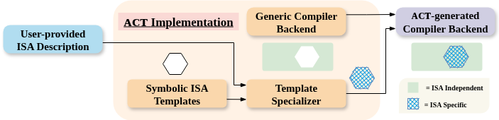

# Hands-on Exercise 3: Generating a Compiler Backend



In this hands-on exercise, you will automatically generate a complete compiler backend from the QKV ISA specification. This demonstrates ACT's core capability: **translating ISA descriptions into working compilers**. You will:

1. Enable backend generation in your ISA specification
2. Write high-level HLO code for attention
3. Compile HLO to QKV assembly using the generated backend
4. Test the compiled kernel against FPGA data

This completes the ACT workflow: **ISA specification** (Exercise 1) → **Manual kernel programming** (Exercise 2) → **Automated compiler generation** (Exercise 3).

---

## Overview: From Manual to Automated

### The Problem with Manual Kernel Programming

In Exercise 2, you experienced the challenges of manual kernel programming:

- Explicit address management for every tensor
- Hardware-specific instruction sequences
- Error-prone and time-consuming
- Not portable across accelerators

**Exercise 3 solution**: Automatically generate a compiler that does all of this for you!

### What ACT Generates

When you call `qkv.generate_backend()`, ACT automatically creates a complete compiler implementation:

```
targets/QKV/backend/
├── src/                # Phase 1: E-graph rewriting (Rust)
│   └── isel/
│       └── rewrites/   # Auto-generated from instruction semantics
├── cpp/                # Phase 2: Constraint solving (C++)
│   └── malloc/
│       └── include/
│           └── instructions.h  # Auto-generated from data models
└── target/release/
    └── backend         # Compiled backend executable
```

**Two-Phase Compilation**:

1. **Instruction Selection**: Pattern matching HLO → ISA instructions (e-graph rewriting)
2. **Memory Allocation**: Address assignment via constraint solving

---

## Step 1: Setting Up Your Development Environment

Let's begin by preparing the skeleton for the attention program in XLA-HLO IR.

From your host machine in the `tutorials/micro25/` directory, copy the boilerplate for Exercise 3.

```bash
./copy.sh exercise3
```

The `copy.sh` script will copy the HLO skeleton `attention.hlo` and test script to the base of the `act/` repository.

### File Structure

Your `act/` directory should now contain:

```
act/
├── attention.hlo       # TODO: Your task - write attention in HLO
└── test_qkv.py        # Test script for compiled kernel
```

You can now edit these files in your preferred editor on your host machine.

---

## Step 2: Enabling Backend Generation

Open your ISA specification from Exercise 1 and add backend generation.

**File**: `QKV.py` (from Exercise 1)

Add one line at the end:

```python
# At the end of QKV.py

# Generate programming APIs and test oracle (from Exercise 1)
qkv.generate_oracle()

# Generate compiler backend (Exercise 3)
qkv.generate_backend()  # ← Add this line
```

### Running the Generator

Now, it's time to generate the compiler backend.
**This step requires running inside the Docker container.**

From your host machine in the `tutorials/micro25/` directory, launch Docker:

```bash
./docker.sh --compile
```

Inside the Docker container, you'll be at the `/workspace` which maps to the `act/` repository.

```bash
# Execute the ISA specification
python QKV.py
```

**Expected Output:**

```
Copied generic oracle structure to /workspace/targets/QKV/oracle
Generated api.py
Oracle API generation complete for QKV
Building oracle for QKV
Oracle build complete for QKV
The oracle API is located at /workspace/targets/QKV/oracle/
Copied generic backend structure to /workspace/targets/QKV/backend
Generated ir2isa_rewrites.txt
Generated ir2isa_rewrites.rs
Generated buffer.rs
Generated egraph.rs
Generated applier.rs
Generated globals.cc
Generated instructions.h
Generated parser.cc
Generated act_malloc.cc
Backend generation complete for QKV
Building backend for QKV
Backend build complete for QKV
Final backend binary located at /workspace/backends/QKV
```

**What just happened?**

- ACT analyzed your ISA specification from Exercise 1
- Generated Rust code for instruction selection
- Generated C++ code for tensor memory allocation
- Compiled both into a working compiler backend binary

---

## Step 3: Understanding What Was Generated

Let's examine the auto-generated compiler code to see how your ISA specification becomes compilation algorithms.

...

---

## Step 4: Writing XLA-HLO for Attention

Now let's write the high-level code that will be compiled to QKV assembly.

### Understanding XLA-HLO

XLA-HLO is a tensor IR used by JAX, TensorFlow, and PyTorch. Key concepts:

**SSA Form**:

```hlo
%variable = operation(operands)
ROOT %output = final_operation
```

**Common Operations**:

- `dot`: Matrix multiplication
- `transpose`: Dimension reordering
- `exponential`, `divide`: Element-wise ops
- `reduce`: Aggregation along dimensions
- `broadcast`: Dimension expansion

### Your Task: Complete the Attention HLO

**File**: `attention.hlo` (skeleton provided in boilerplate)

```hlo
HloModule qkv, entry_computation_layout={(bf16[64,64]{1,0}, bf16[64,64]{1,0}, bf16[64,64]{1,0})->bf16[64,64]{1,0}}

// Helper function for reduce_sum
%reduce_add (x: bf16[], y: bf16[]) -> bf16[] {
  %x = bf16[] parameter(0)
  %y = bf16[] parameter(1)
  ROOT %sum = bf16[] add(%x, %y)
}

ENTRY main {
  // Input tensors
  %q = bf16[64,64] parameter(0)
  %k = bf16[64,64] parameter(1)
  %v = bf16[64,64] parameter(2)

  // Step 1: Compute attention scores S = Q × K^T

  // Step 2: Apply softmax normalization

  // Step 3: Compute weighted sum O = P × V
}
```

### Implementation Hints

1. **Transpose**: `%k_transpose = bf16[64,64] transpose(%k), dimensions={1,0}`

2. **Dot product**: `%result = bf16[64,64] dot(%lhs, %rhs), lhs_contracting_dims={1}, rhs_contracting_dims={0}`

3. **Reduce**: `%sum = bf16[64] reduce(%input, %zero), dimensions={1}, to_apply=%reduce_add`

4. **Broadcast**: `%expanded = bf16[64,64] broadcast(%sum), dimensions={0}`

5. **Think high-level**: You're describing **what** to compute, not **how**. The compiler handles all addressing and instruction selection!

### Complete Implementation

**File**: `attention.hlo` (Complete)

```hlo
HloModule qkv, entry_computation_layout={(bf16[64,64]{1,0}, bf16[64,64]{1,0}, bf16[64,64]{1,0})->bf16[64,64]{1,0}}

// Helper function for reduce_sum
%reduce_add (x: bf16[], y: bf16[]) -> bf16[] {
  %x = bf16[] parameter(0)
  %y = bf16[] parameter(1)
  ROOT %sum = bf16[] add(%x, %y)
}

ENTRY main {
  // Input tensors
  %q = bf16[64,64] parameter(0)
  %k = bf16[64,64] parameter(1)
  %v = bf16[64,64] parameter(2)

  // Step 1: Compute attention scores S = Q × K^T
  %k_transpose = bf16[64,64] transpose(%k), dimensions={1,0}
  %scores = bf16[64,64] dot(%q, %k_transpose), lhs_contracting_dims={1}, rhs_contracting_dims={0}

  // Step 2: Apply softmax normalization
  %scores_exp = bf16[64,64] exponential(%scores)

  %zero = bf16[] constant(0)
  %sum = bf16[64] reduce(%scores_exp, %zero), dimensions={1}, to_apply=%reduce_add

  %sum_broadcast = bf16[64,64] broadcast(%sum), dimensions={0}
  %probs = bf16[64,64] divide(%scores_exp, %sum_broadcast)

  // Step 3: Compute weighted sum O = P × V
  ROOT %output = bf16[64,64] dot(%probs, %v), lhs_contracting_dims={1}, rhs_contracting_dims={0}
}

```

---

## Step 5: Compiling HLO to Assembly

Now that you've completed the HLO program, it's time to compile it using the generated backend.
**This step requires running inside the Docker container.**

From your host machine in the `tutorials/micro25/` directory, launch Docker:

```bash
./docker.sh --compile
```

Inside the Docker container, you'll be at the `/workspace` which maps to the `act/` repository.

```bash
# Compile attention.hlo to assembly
./backends/QKV --input attention.hlo --output asm/compiled_qkv.py
```

### Examining the Generated Assembly

**File**: `asm/compiled_qkv.py`

```python
# Input file: log.hlo
# Kernel name: qkv
# PII number: 0
# Do not edit!

import jax.numpy as jnp


def qkv(kernel, api):
    @kernel(hbm=32768,
            input=[
                {'addr': 0, 'shape': (64, 64), 'dtype': jnp.bfloat16},
                {'addr': 8192, 'shape': (64, 64), 'dtype': jnp.bfloat16},
                {'addr': 16384, 'shape': (64, 64), 'dtype': jnp.bfloat16},
            ],
            constant=[],
            output=[
                {'addr': 24576, 'shape': (64, 64), 'dtype': jnp.bfloat16},
            ]
            )
    def qkv_():
        api.load_rm(n = 64, addr_in = 0, addr_out = 64)
        api.load_cm(n = 64, addr_in = 8192, addr_out = 0)
        api.gemm(addr_1 = 64, addr_2 = 0, addr_out = 0)
        api.softmax(n = 64, addr = 0)
        api.mov(n = 64, addr_in = 0, addr_out = 64)
        api.load_rm(n = 64, addr_in = 16384, addr_out = 0)
        api.gemm(addr_1 = 64, addr_2 = 0, addr_out = 0)
        api.mov(n = 64, addr_in = 0, addr_out = 0)
        api.store_rm(n = 64, addr_in = 0, addr_out = 24576)

    return qkv_
```

**Very Similar to your hand-written kernel from Exercise 2!**
Let's test if this is still correct.

---

## Step 6: Testing the Compiled Kernel

Let's verify the compiled kernel produces correct results using TAIDL-TO and FPGA data.

### Understanding the Test Script

The test script `test_qkv.py` does the following:

1. **Imports the compiled kernel** from `asm/compiled_qkv.py`
2. **Imports TAIDL-TO** (test oracle from Exercise 1)
3. **Loads FPGA test data** (same data from Exercise 2)
4. **Runs functional simulation** of compiled kernel
5. **Compares outputs** with FPGA golden reference

### Running the Test

Now that you've compiled the HLO program, it's time to validate the compiled assembly against real FPGA data using the generated test oracle.

From your host machine in the `tutorials/micro25/` directory, launch Docker:

```bash
./docker.sh --sim
```

Inside the Docker container, you'll be at the `/workspace` which maps to the `act/` repository.

```bash
# Run the test script
python test_qkv.py
```

### Expected Output (Successful Compilation)

```
Simulation ready in 534ms
Loaded data/Q.dat, data/K.dat, data/V.dat (raw bfloat16 bits)
Simulation ran in 856ms
Inputs:
  Q: (64, 64), bfloat16
  K: (64, 64), bfloat16
  V: (64, 64), bfloat16
Outputs:
  Output: (64, 64), bfloat16
Loaded data/attention.dat (raw bfloat16 bits) as golden output
Max absolute difference between simulation and golden: 0.0
Output matches golden exactly!
Great! The compiled attention kernel is correct.
```

**Perfect!** The automatically compiled kernel matches the FPGA reference data.

### Debugging Failed Compilations

If compilation fails or produces incorrect results:

**Common Issues:**

1. **Missing operations in HLO**

   ```
   [Phase 1] Error: No rewrite rule found for operation 'xyz'
   ```

   Check: Did you use only supported HLO operations?

2. **Shape mismatches**

   ```
   [Phase 1] Error: Shape mismatch - expected [64,64], got [64,64,1]
   ```

   Check: Are all intermediate tensor shapes correct?

3. **Incorrect output**
   ```
   Max absolute difference between simulation and golden: 12.5
   ```
   Check: Is your HLO logic correct? Compare with the mathematical formula.

**Debugging Tips:**

- Start with simple HLO (just Q × K^T)
- Add operations incrementally
- Check intermediate shapes match expectations
- Verify against the solution if stuck

**Need help?** Check `exercise3/solution/attention.hlo` for the complete HLO implementation.

---

## Key Takeaways

### What You've Learned

1. **Automatic Compiler Generation**: From ISA specification to working compiler

   - No manual compiler engineering required
   - Derived directly from TAIDL specification

2. **High-Level Programming**: Write in HLO instead of assembly

   - Describe **what** to compute, not **how**
   - Compiler handles all low-level details

3. **Correctness by Construction**: Generated compiler is provably correct

   - Respects ISA semantics
   - Validated against FPGA data

4. **Productivity Multiplier**: Weeks of work → Minutes of generation
   - Traditional approach: 6+ months of manual compiler development
   - ACT approach: Automatic generation from existing ISA spec

### The Automation Story

```
Exercise 2 (Manual):
  Write HLO → Manually translate to assembly → Allocate addresses
  [Minutes of work, error-prone, hardware-specific]

Exercise 3 (Automated):
  Write HLO → Run compiler → Get assembly
  [Milliseconds, guaranteed correct, same parameterized algorithm works for any accelerator]
```

### Compiler Characteristics

The generated backend is:

- **Provably Sound**: Respects ISA semantics from Exercise 1
- **Provably Complete**: Can compile any operation expressible with ISA
- **Fast**: Compilation in <1 second for typical programs
- **Performant**: Uses cost models to find low-cost instruction sequences

---

## Conclusion

The compiler you generated represents months of traditional compiler engineering work, now automatically derived from your ISA specification. In Demonstration 2, you'll see how this connects to real ML frameworks like JAX!
